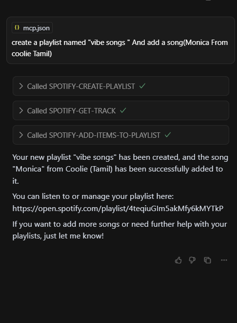
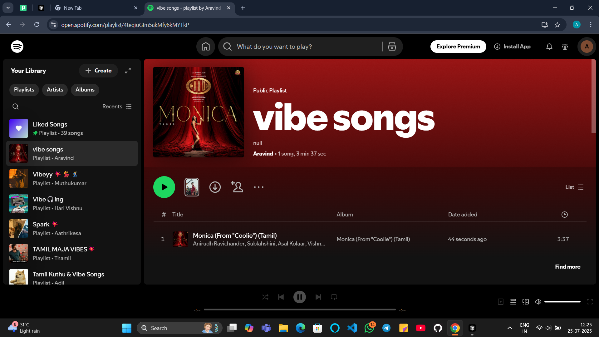
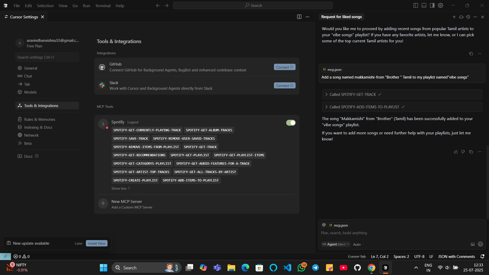
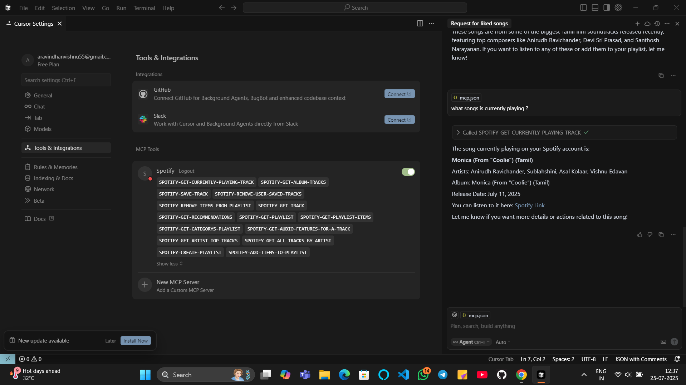

# Spotify-Automation-with-MCP-Server-Cursor-AI-Agent
An AI-powered automation system that integrates a Spotify MCP Server with Cursor IDE, allowing users to control Spotify playlists and tracks using natural language commands executed by an AI agent in the background.


## 🚀 Project Overview

This project demonstrates a **Model Context Protocol (MCP) Server** integrated with **Cursor IDE** to control **Spotify** using natural language commands.

By simply typing commands like:

> `create a playlist named "vibe songs" and add Monica from Coolie (Tamil)`

…the **Cursor AI Agent** automatically performs actions in the background on Spotify, such as:

* Creating playlists
* Adding/removing tracks
* Fetching currently playing songs
* Managing liked songs

No manual API calls or UI interaction required — everything works through **AI-driven command execution**.

---

## 🧠 How It Works (Architecture)

1. **Cursor IDE** acts as the AI interface
2. **MCP Server** exposes Spotify-related tools
3. **Spotify Web API** executes real actions on your account
4. User gives **plain English commands** → AI maps them to MCP actions

```
User Command
   ↓
Cursor AI Agent
   ↓
MCP Server (Spotify Tools)
   ↓
Spotify Web API
   ↓
Action Executed (Playlist / Track / Info)
```

---

## ✨ Key Features

* 🎵 Create Spotify playlists via natural language
* ➕ Add songs to playlists automatically
* ▶️ Get currently playing track
* ❤️ Save / remove liked songs
* 📂 Fetch playlists, albums, artists & tracks
* ⚡ Runs silently in the background via Cursor Agent

---

## 🛠️ MCP Spotify Tools Used

The project uses built-in MCP tools such as:

* `SPOTIFY-CREATE-PLAYLIST`
* `SPOTIFY-GET-TRACK`
* `SPOTIFY-ADD-ITEMS-TO-PLAYLIST`
* `SPOTIFY-GET-CURRENTLY-PLAYING-TRACK`
* `SPOTIFY-SAVE-TRACK`
* `SPOTIFY-REMOVE-ITEMS-FROM-PLAYLIST`
* `SPOTIFY-GET-PLAYLIST`

---

## 🧪 Example Commands

```text
Create a playlist named "vibe songs"
Add the song Makkamishi from Brother (Tamil) to my playlist vibe songs
What song is currently playing?
Remove this song from my playlist
Save the current song to liked songs
```

---

## 🖥️ Tech Stack

* **Cursor IDE** (AI-powered code editor)
* **Model Context Protocol (MCP)**
* **Spotify Web API**
* **JSON-based MCP tool configuration**
* **AI Agent Execution**

---

## 📸 Screenshots


🎵 Create Spotify playlists via natural language







➕ Add songs to playlists automatically





▶️ Get currently playing track





---

## 🎯 Use Cases

* Voice / text-based music automation
* AI-powered personal music assistant
* Hands-free playlist management
* Demonstration of MCP + Agent workflows

---

## 📌 Future Enhancements

* Voice command integration
* Multi-platform music support
* Smart recommendations using AI
* Custom playlist rules (mood, genre, time)

---

## 👤 Author

**Aravindhan K**
 AI & Automation Enthusiast

---

⭐ If you found this project useful, don’t forget to star the repository!
